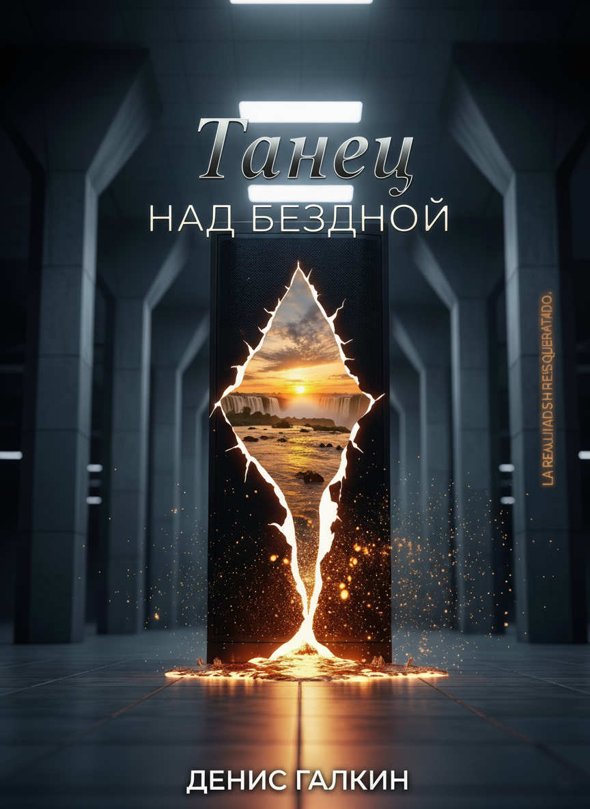

# Танец над Бездной / Danza sobre el Abismo

  <strong><a href="#ru">Русская версия</a></strong> | <strong><a href="#es">Versión en español</a></strong>

---

  

  
  
  

### Аннотация

> **Что более вечно: камень, обреченный на эрозию, или цветок, хранящий в себе код бесконечного самокопирования?**

Этот вопрос преследует Дениса — гениального программиста, который видит в успехе природы жестокую насмешку. Ведь самое уникальное, что она создает — человеческое "Я" — оказывается трагическим сбоем: оно не копируется и стирается навсегда. Его депрессия — это не болезнь, а слишком ясное осознание этой вселенской несправедливости.

Он бежит в самое сердце хаоса, в Игуасу, где сходятся границы трех стран, надеясь, что оглушительный рев водопадов заглушит шум в его голове. Но вместо тишины он находит Йесику.

Танцовщица, чье одно прикосновение приносит ему необъяснимый покой. Женщина, которая предлагает не бороться с забвением, а раствориться в потоке. Она — живое опровержение всех его законов. И она же — ключ к миру, скрытому под поверхностью реальности.

Миру, где в секретных лабораториях под гигантской ГЭС пытаются "оцифровать" душу, спасая ее от стирания. Где гедонисты охотятся за последним ярким ощущением перед неизбежным финалом. И где сама земля помнит древних существ, пробуждающихся от чужого вмешательства.

Связь Дениса и Йесики — аномалия, которая привлекает внимание всех игроков. Теперь им предстоит найти ответ на главный вопрос: если твое "Я" обречено, стоит ли пытаться спасти его любой ценой? Или единственное спасение — научиться танцевать над бездной?

### 📖 Содержание

*   **ПРОЛОГ. ФРАГМЕНТЫ**
    *   [I. Под Рекой](./manuscript/ru/00-prologue/01-pod-rekoy.md)
    *   [II. Мост](./manuscript/ru/00-prologue/02-most.md)
    *   [III. Песня Гуарани](./manuscript/ru/00-prologue/03-pesnya-guarani.md)
*   **ЧАСТЬ ПЕРВАЯ. ДВОЕ**
    *   **Глава 1. Нулевой Указатель**
        *   [Сцена 1. Мертвая Петля](./manuscript/ru/01-part-one/ch01-nulevoy-ukazatel/01-scena-mertvaya-petlya.md)
        *   [Сцена 2. Первый Шаг](./manuscript/ru/01-part-one/ch01-nulevoy-ukazatel/02-scena-pervyy-shag.md)
    *   **Глава 2. Холодное Эхо**
        *   [Сцена 1. Повторение и Сбой](./manuscript/ru/01-part-one/ch02-kholodnoe-ekho/01-scena-povtorenie-i-sboy.md)
        *   [Сцена 2. След на Холсте](./manuscript/ru/01-part-one/ch02-kholodnoe-ekho/02-scena-sled-na-kholste.md)
        *   [Сцена 3. Разговор на Двух Языках](./manuscript/ru/01-part-one/ch02-kholodnoe-ekho/03-scena-razgovor-na-dvukh-yazykakh.md)
    *   **[ИНТЕРЛЮДИЯ I. ФАЛЬШИВОЕ ЗОЛОТО](./manuscript/ru/01-part-one/interlude-I-falshivoe-zoloto/00-interlude-falshivoe-zoloto.md)**
    *   **Глава 3. Коррозия Реальности**
        *   [Сцена 1. Призраки в Машине](./manuscript/ru/01-part-one/ch03-korroziya-realnosti/01-scena-prizraki-v-mashine.md)
        *   [Сцена 2. Неправильная Песня](./manuscript/ru/01-part-one/ch03-korroziya-realnosti/02-scena-nepravilnaya-pesnya.md)
        *   [Сцена 3. Ошибка Округления](./manuscript/ru/01-part-one/ch03-korroziya-realnosti/03-scena-oshibka-okrugleniya.md)
        *   [Сцена 4. Холодное Пятно](./manuscript/ru/01-part-one/ch03-korroziya-realnosti/04-scena-kholodnoe-pyatno.md)
*   **ИНТЕРЛЮДИЯ II. ПАМЯТЬ ЗМЕЯ**
    *   [Часть 1. Проект "Орфей"](./manuscript/ru/02-interlude-II-pamyat-zmeya/01-chast-proekt-orfey.md)
    *   [Часть 2. Белый Шум](./manuscript/ru/02-interlude-II-pamyat-zmeya/02-chast-belyy-shum.md)
    *   [Часть 3. Проповедь в Камне](./manuscript/ru/02-interlude-II-pamyat-zmeya/03-chast-propoved-v-kamne.md)
    *   [Часть 4. Аромат Грозы](./manuscript/ru/02-interlude-II-pamyat-zmeya/04-chast-aromat-grozy.md)

---

##  🇦🇷 Danza sobre el Abismo

  
  
  

### Sinopsis

> **¿Qué es más eterno: la piedra, condenada a borrarse, o la flor, que guarda el código para copiarse hasta el infinito?**

Esa pregunta persigue a Denis, un programador genial que ve en el éxito de la naturaleza una broma cruel. Porque lo más único que ella crea —el Yo humano— resulta ser una falla trágica: no se puede copiar y se borra para siempre. Su depresión no es una enfermedad, es la lucidez insoportable de esa injusticia universal.

Huye al corazón mismo del caos, a Iguazú, donde se tocan las fronteras de tres países, esperando que el rugido ensordecedor de las cataratas le apague el ruido de la cabeza. Pero en lugar de silencio, la encuentra a Yésica.

Una bailarina cuyo simple contacto le trae una calma inexplicable. Una mujer que le propone no pelear contra el olvido, sino disolverse en la corriente. Ella es la refutación viva de todas sus leyes. Y es, también, la llave a un mundo oculto bajo la piel de la realidad.

Un mundo donde, в laboratorios secretos bajo una represa gigante, intentan "digitalizar" el alma para salvarla de la nada. Где гедонисты охотятся за последним ярким ощущением перед неизбежным финалом. Y donde la tierra misma recuerda a seres antiguos, que despiertan cuando alguien interfiere con ella.

La conexión entre Denis y Yésica es una anomalía que llama la atención de todos los jugadores. Ahora, van a tener que encontrar la respuesta a la pregunta final: si tu Yo está condenado, ¿vale la pena salvarlo a cualquier precio? ¿O la única salvación es aprender a danzar sobre el abismo?

### 📖 Índice

*   **PRÓLOGO. FRAGMENTOS**
    *   [I. Debajo del Río](./manuscript/es/00-prologue/01-debajo-del-rio.md)
    *   [II. El Puente](./manuscript/es/00-prologue/02-el-puente.md)
    *   [III. La Canción Guaraní](./manuscript/es/00-prologue/03-la-cancion-guarani.md)
*   **PRIMERA PARTE. LOS DOS**
    *   **Capítulo 1. Puntero Nulo**
        *   [Escena 1. Bucle Infinito](./manuscript/es/01-part-one/ch01-puntero-nulo/01-escena-bucle-infinito.md)
        *   [Escena 2. El Primer Paso](./manuscript/es/01-part-one/ch01-puntero-nulo/02-escena-el-primer-paso.md)
    *   **Capítulo 2. Eco Frío**
        *   [Escena 1. Repetición y Fallo](./manuscript/es/01-part-one/ch02-eco-frio/01-escena-repeticion-y-fallo.md)
        *   [Escena 2. La Huella en el Lienzo](./manuscript/es/01-part-one/ch02-eco-frio/02-escena-la-huella-en-el-lienzo.md)
        *   [Escena 3. Una Conversación en Dos Idiomas](./manuscript/es/01-part-one/ch02-eco-frio/03-escena-conversacion-en-dos-idiomas.md)
    *   **[INTERLUDIO I. ORO FALSO](./manuscript/es/01-part-one/interlude-I-oro-falso/00-interlude-oro-falso.md)**
    *   **Capítulo 3. La Corrosión de lo Real**
        *   [Escena 1. Fantasmas en la Máquina](./manuscript/es/01-part-one/ch03-la-corrosion-de-lo-real/01-escena-fantasmas-en-la-maquina.md)
        *   [Escena 2. La Canción Equivocada](./manuscript/es/01-part-one/ch03-la-corrosion-de-lo-real/02-escena-la-cancion-equivocada.md)
        *   [Escena 3. Error de Redondeo](./manuscript/es/01-part-one/ch03-la-corrosion-de-lo-real/03-escena-error-de-redondeo.md)
        *   [Escena 4. La Mancha Fría](./manuscript/es/01-part-one/ch03-la-corrosion-de-lo-real/04-escena-la-mancha-fria.md)
*   **INTERLUDIO II. MEMORIA DO M'BOI**
    *   [Parte 1. Proyecto Orfeo](./manuscript/es/02-interlude-II-memoria-do-mboi/01-parte-proyecto-orfeo.md)
    *   [Parte 2. Ruido Blanco](./manuscript/es/02-interlude-II-memoria-do-mboi/02-parte-ruido-blanco.md)
    *   [Parte 3. El Sermón en la Piedra](./manuscript/es/02-interlude-II-memoria-do-mboi/03-parte-el-sermon-en-la-piedra.md)
    *   [Parte 4. Aroma de Tormenta](./manuscript/es/02-interlude-II-memoria-do-mboi/04-parte-aroma-de-tormenta.md)
    
---

### 👤 Автор / Autor / Author

*   **RU:** `Автор:` Денис Галкин | `Сайт:` [denser.ru](https://denser.ru) | `Контакт:` [mail@denser.ru](mailto:mail@denser.ru)
*   **ES:** `Autor:` Denis Galkin | `Sitio Web:` [denser.ru](https://denser.ru) | `Contacto:` [mail@denser.ru](mailto:mail@denser.ru)
*   **EN:** `Author:` Denis Galkin | `Website:` [denser.ru](https://denser.ru) | `Contact:` [mail@denser.ru](mailto:mail@denser.ru)

### © Авторские Права / Copyright

*   **RU:** © 2024, Денис Галкин. Все права защищены.
*   **ES:** © 2024, Denis Galkin. Todos los derechos reservados.
*   **EN:** © 2024, Denis Galkin. All rights reserved.

 

*   **RU:** Это произведение доступно по лицензии [Creative Commons «Attribution-NonCommercial-NoDerivatives» 4.0 Всемирная](http://creativecommons.org/licenses/by-nc-nd/4.0/).
*   **ES:** Esta obra está bajo una [Licencia Creative Commons Atribución-NoComercial-SinDerivadas 4.0 Internacional](http://creativecommons.org/licenses/by-nc-nd/4.0/).
*   **EN:** This work is licensed under a [Creative Commons Attribution-NonCommercial-NoDerivatives 4.0 International License](http://creativecommons.org/licenses/by-nc-nd/4.0/).